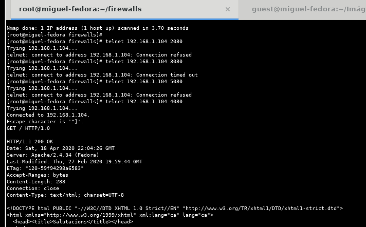
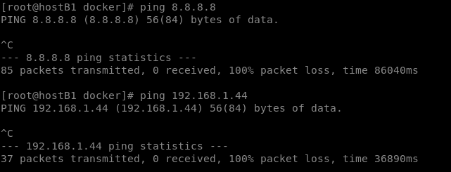
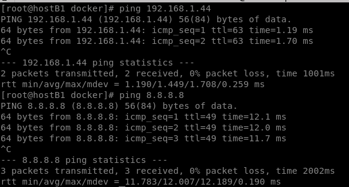
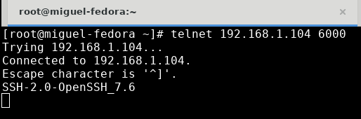
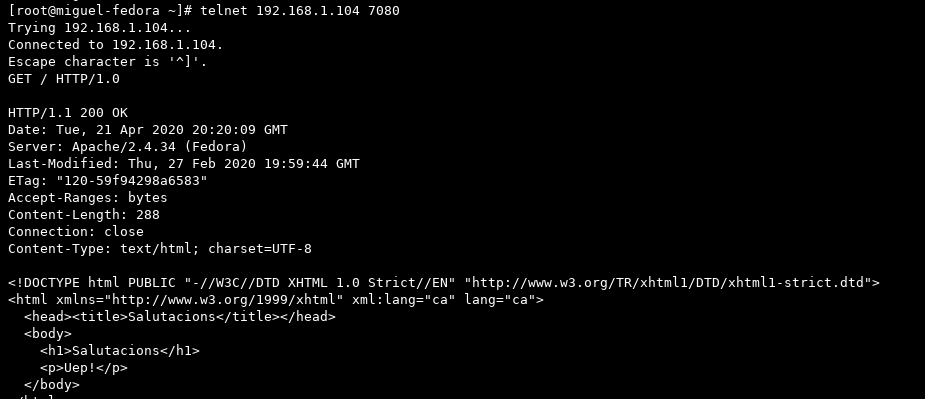

# <u>__PRÁCTICA 4 - FIREWALLS__</u>
# **Índice**
1. [IPs](#id1)   
2. [Conceptos previos](#id2)  
3. [EJEMPLOS](#id3)  
    3.1. [Ejemplo Inicial: ip-default.sh](id00)  


<a name="id1"></a>
## __IPs__
+ __IP host principal:__ 192.168.1.104  
+ __IP host 2:__ 192.168.1.44  
+ __IP dockers:__ 172.19.0.2  / 172.19.0.3 / 172.19.0.4  
`[isx46410800@miguel firewalls]$ docker run --rm --name net1 -h net1 --net mynet -d isx46410800/firewalls:net19`  
`[isx46410800@miguel firewalls]$ docker run --rm --name net2 -h net2 --net mynet -d isx46410800/firewalls:net19`  
`[isx46410800@miguel firewalls]$ docker run --rm --name net3 -h net3 --net mynet -d isx46410800/firewalls:net19`  
+ __IP nets:__ netA(172.18.0.0/16) / netB(172.19.0.0/16) / netZ(172.20.0.0/16)  

<a name="id2"></a>  
## __Conceptos previos__  
+ __drop y reject:__ reject te informa del error mientras que drop agota el tiempo de espera sin notificar al momento del error de conexión.  
+ __related y established:__ ESTABLISHED el paquete seleccionado se asocia con otros paquetes en una conexión establecida mientras que RELATED el paquete seleccionado está iniciando una nueva conexión en algún punto de la conexión existente.
+ __-j:__  tipo de salto/objetivo (accept, drop, reject...)
+ __-d:__ destino
+ __-s:__ origen
+ __-F:__ flush, vaciar    
+ __-A:__ append
+ __-P:__ política de accept o drop   
+ __-I:__ insertar  
+ __--dport:__ configura el puerto de destino para el paquete.
+ __--sport:__ configura el puerto de origen para el paquete.      
+ __-p:__ protocolo   
+ __--icmp-type 8:__ ICMP type 8, Echo request message.  
+ __--icmp-type 0:__ ICMP type 0, Echo reply message.  

<a name="id3"></a>  
# EJEMPLOS  

<a name="id00"></a>  
## __Ejemplo Inicial: `ip-default.sh`__
En este ejemplo borramos todas las reglas actuales, establecemos una politica por defecto de todo abierto, permite todo el tráfico de entrada/salida en loopback y en nuestra IP host local. (Igualmente por defecto la politica por defecto ACCEPT ya lo hacía). También indicamos si el host hace de router, en este caso no.

[script ip-default.sh](practica4/ip-default.sh)  

+ En cada script ponemos la orden `iptables -L -t nat` para que al ejecutarlo, nos muestre las reglas generadas:  
```
[root@miguel firewalls]# ./ip-default.sh
Chain PREROUTING (policy ACCEPT)
target     prot opt source               destination         
Chain INPUT (policy ACCEPT)
target     prot opt source               destination         
Chain OUTPUT (policy ACCEPT)
target     prot opt source               destination         
Chain POSTROUTING (policy ACCEPT)
target     prot opt source               destination         
Chain DOCKER (0 references)
target     prot opt source               destination   
```

#### __COMPROBACIONES__  
+ Entre un host principal y otro ordenador(host 2) hacemos intercambio de pings, ssh, telnet de servicios echo, daytime... para comprobar que en efecto, sí se acepta todo tipo de conexiones de entrada y salida propias de la interficie y del loopback.


## __Ejemplo 01: `ip-01-input.sh`__  
En este ejemplo continuamos con la misma parte de por defecto pero ahora establecemos unas serie de reglas `INPUT` para el tráfico de entrada por nuestro puerto 80. Los diferentes puertos abiertos relacionados con el puerto 80 de httpd están configurados en `/etc/xinetd.d/`.  

En nuestro caso empleamos dos ordenadores, el principal y el host2. Hemos establecido reglas en que según que puerto indiquemos (2080,3080...) permitiremos que nuestro host2 pueda o no acceder o que otros hosts de la red puedan conectarnos por estos puertos. Las reglas iptables en este apartado están puestas en el host principal.  

[script ip-01-input.sh](practica4/ip-01-input.sh)  

#### __COMPROBACIONES__  
+ Seguimos viendo que para conectarnos al host2 no tenemos problemas ya que no hemos cambiado ninguna regla de `OUTPUT`  


+ Aquí sí podemos ver que ahora al conectarnos según que puerto nos permite o no el acceso desde host2: por ejemplo, por el puerto 2080, 3080, 5080 y 6080 no podrá acceder pero sí por el puerto 4080 y 7080.  




## __Ejemplo 02: `ip-02-output.sh`__
En este ejemplo continuamos con la misma parte de por defecto pero ahora establecemos unas serie de reglas `OUTPUT` para el tráfico de SALIDA por nuestro puerto 13. Los diferentes puertos abiertos relacionados con el puerto 13 del servicio daytime están configurados en `/etc/xinetd.d/`.  

En nuestro caso empleamos dos ordenadores, el principal (con 3 hosts de containers) y el host2. Hemos establecido reglas en que según que puerto indiquemos (2013,3013...) permitiremos que nuestro principal pueda o no acceder al host2 o a los host de los containers. Las reglas iptables en este apartado están puestas en el principal.  

[script ip-02-output.sh](practica4/ip-02-output.sh)  

#### __COMPROBACIONES__  
+ Acceder a port 13 de cualquier destino:  
  `iptables -A OUTPUT -p tcp --dport 13 -j ACCEPT`  
  `iptables -A OUTPUT -p tcp --dport 13 -d 0.0.0.0/0  -j ACCEPT`  


> Vemos que podemos acceder al puerto 13 de cualquier host

+ Acceder a cualquier puerto 2013 excepto el de host2:  
  `iptables -A OUTPUT -p tcp --dport 2013 -d 192.168.1.44 -j REJECT`  
  `iptables -A OUTPUT -p tcp --dport 2013 -j ACCEPT`  


> Vemos que en este caso no podemos acceder al puerto 2013 del host2

+ Denegado acceder a cualquier puerto 3013 pero sí al del host2:  
  `iptables -A OUTPUT -p tcp --dport 3013 -d 192.168.1.44 -j ACCEPT`  
  `iptables -A OUTPUT -p tcp --dport 3013 -j REJECT`  


> Vemos que podemos acceder al puerto 3013 del host2

+ Abierto a todos el puerto 4013, cerrado a casa y abierto a host2:  
  `iptables -A OUTPUT -p tcp --dport 4013 -d 192.168.1.44 -j ACCEPT`  
  `iptables -A OUTPUT -p tcp --dport 4013 -d 192.168.1.0/24 -j REJECT`  
  `iptables -A OUTPUT -p tcp --dport 4013 -j ACCEPT`  


> Vemos que está abierto para acceder a host2 y para net1

+ Cerrado cualquier acceso a los puertos 80, 13 u 7:  
  `iptables -A OUTPUT -p tcp --dport 80 -j REJECT`  
  `iptables -A OUTPUT -p tcp --dport 13 -j REJECT`  
  `iptables -A OUTPUT -p tcp --dport 7  -j REJECT`  


> Vemos que están cerrados todos los accesos a los puertos 80,13 y 7 tanto para conectar a host2 como net1.

+ No permitir acceder ni al host2 ni a net1:  
  `iptables -A OUTPUT -d 192.168.1.44 -j REJECT`  
  `iptables -A OUTPUT -d 172.19.0.2 -j REJECT`  


> En este caso está cerrado tanto para host2 y net1 cualquier acceso a ellos.

+ No permitir acceder a las redes de casa y mynet:  
  `iptables -A OUTPUT -d 192.168.1.0/24 -j REJECT`
  `iptables -A OUTPUT -d 172.19.0.0/24 -j REJECT`  


> No podemos acceder a las redes de casa ni de mynet por ninguno de sus puertos.

+ A la red mynet no se puede acceder, solo por ssh:  
  `iptables -A OUTPUT -p tcp --dport 22 -d 192.168.2.0/24 -j ACCEPT`  
  `iptables -A OUTPUT -d 192.168.2.0/24 -j REJECT`  


> Vemos que no podemos acceder a mynet por ningún puerto excepto por el 22 de ssh.

## __Ejemplo 03: `ip-03-established.sh`__  
Conceptos del estado:  
`--state — coincide un paquete con los siguientes estados de conexión:`  
+ ESTABLISHED: El paquete seleccionado se asocia con otros paquetes en una conexión establecida.
+ INVALID: El paquete seleccionado no puede ser asociado a una conexión conocida.
+ NEW: El paquete seleccionado o bien está creando una nueva conexión o bien forma parte de una conexión de dos caminos que antes no había sido vista.
+ RELATED: El paquete seleccionado está iniciando una nueva conexión en algún punto de la conexión existente.  

En este ejemplo trabajamos para ver la diferencia en no permitir un host acceder a los servicios web externos (reglas OUTPUT) y en permitir el tráfico exterior al servidor web del propio host y permitir que este servidor emita respuestas http a los clientes (reglas INPUT). También tener en cuenta que para permitir el tráfico de respuesta será una regla OUTPUT.  

[script ip-03-established.sh](practica4/ip-03-established.sh)  

#### __COMPROBACIONES__  
+ Permitir navegador por web (mala manera):  
  `iptables -A OUTPUT -p tcp --dport 80 -j ACCEPT`  
  `iptables -A INPUT  -p tcp --sport 80 -j ACCEPT`  

  

  

> Acepto conexiones tanto de entrada como de salida por el puerto 80.  

+ Filtrar tráfico solo de respuesta:  
  `iptables -A OUTPUT -p tcp --dport 80 -j ACCEPT`  
  `iptables -A INPUT  -p tcp --sport 80 -m tcp -m state --state RELATED,ESTABLISHED  -j ACCEPT`  

  

> Aquí vemos el filtrado por wireshark de una conexión de salida del principal al host2  

  

> Aquí vemos el filtrado por wireshark de una conexión de entrada de net1 al principal

+ Ofrecer el servicio web, permitir solo respuestas a peticiones ya establecidas:  
  `iptables -A OUTPUT -p tcp --sport 80 -m tcp -m state --state RELATED,ESTABLISHED -j ACCEPT`     
  `iptables -A INPUT -p tcp --dport 80 -j ACCEPT`  

  

> Aquí vemos el filtrado por wireshark de una conexión de salida de host2 al principal

  

> Aquí vemos el filtrado por wireshark de una conexión de entrada de host2 al principal

+ Ofrecer el servicio web a todos excepto a host2:  
  `iptables -A OUTPUT -p tcp --sport 80 -m tcp -m state --state RELATED,ESTABLISHED -j ACCEPT`  
  `iptables -A INPUT -p tcp --dport 80 -s 192.168.1.44 -j REJECT`  
  `iptables -A INPUT -p tcp --dport 80 -j ACCEPT`  

  

  

  

> Puedo establacer comunicaciones hacia fuera por el puerto 80, pero hacia dentro todos pueden excepto el host2

## __Ejemplo 04:`ip-04-icmp.sh`__
En este ejemplo utilizaremos unas reglas personalizadas para los pings que puede hacer o no nuestro ordenador principal respecto a diferentes casos configurados en iptables.  

[script ip-04-icmp.sh](practica4/ip-04-icmp.sh)  

#### __COMPROBACIONES__  
+ No permitir hacer pings al exterior:  
  `iptables -A OUTPUT -p icmp --icmp-type 8 -j DROP`

  

> Vemos que no nos deja hacer pings de salida como por ejemplo google o al host2

+ No podemos hacer pings al host2:  
  `iptables -A OUTPUT -p icmp --icmp-type 8 -d 192.168.1.44 -j DROP`

  

> En este caso podemos hacer pings al exterior como por ejemplo google pero hemos rechazado hacer al host2

+ No permitimos responder a los pings que nos hagan:    
  `iptables -A OUTPUT -p icmp --icmp-type 0 -j DROP`

  

> Establecemos la regla de que no nos puedan hacer ping, con la opción de DROP en la que se les agotará el tiempo sin dar un código de error antes, como sí que haría con REJECT

+ No aceptamos recibir respuestas de ping:  
  `iptables -A INPUT -p icmp --icmp-type 0 -j DROP`

  

> Regla para que no podamos recibir respuesta de los pings que hagamos al exterior

## __Ejemplo 05: `ip-05.nat.sh`__
En este ejemplo vemos el concepto de NAT, el cual hacemos que un host actue como router activando el bit de forwading. Permitiremos que redes internas de un host puedan comunicarse al exterior enmascarando su ip interna en la interficie local y externa del host que actua como router para poder hacer comunicaciones por un puerto de salida dinámico.  

[script ip-05-nat.sh](practica4/ip-05-nat.sh)  

Para activar NAT en nuestro host principal para que las redes internas privadas puedan salir al exterior:  
```
[root@miguel firewalls]# echo 1 > /proc/sys/net/ipv4/ip_forward
[root@miguel firewalls]# cat /proc/sys/net/ipv4/ip_forward
1
```

#### __COMPROBACIONES__  

+ Creamos dos redes internas con docker:  
```
[isx46410800@miguel ~]$ docker network create netA
ae2000b70614f635956dbb49771fcb398de25efc36313bc14989d830b24df036
[isx46410800@miguel ~]$ docker network create netB
a2577e8c47a940c98507cd05019f38e36f514f202ef34a50cfc5aea77bfa527e
[isx46410800@miguel ~]$ docker network create netZ
497a82c6b1c83c88e8e5a69c73728411c39c858adba41011e54edb365a67ee8a
```

+ Encendemos en cada red (netA y netB) dos hosts:  
```
[isx46410800@miguel ~]$ docker run --rm --name hostA1 -h hostA1 --net netA --privileged -d isx46410800/firewalls:net19
1ee450755d3cffc0fbf9c037d7f38fcf0bfb243336bcd728010e765ecaf1d522
[isx46410800@miguel ~]$ docker run --rm --name hostA2 -h hostA2 --net netA --privileged -d isx46410800/firewalls:net19
e62d644808dab64a6787fc2fbdb131482d385ed42e0523792e974ff6ad70ab75
[isx46410800@miguel ~]$ docker run --rm --name hostB1 -h hostB1 --net netB --privileged -d isx46410800/firewalls:net19
cb73604669c50b8cbe63740d17675f8cda011331fb3d5da21a6d70dc1b27b8aa
[isx46410800@miguel ~]$ docker run --rm --name hostB2 -h hostB2 --net netB --privileged -d isx46410800/firewalls:net19
d9f54d44aa59fef8cc9963b41fb99d2ebaced2565340e70b892ce3b869403b6e
[script ip-05.nat.sh](practica4/ip-05.nat.sh)  
```

+  Vemos que está encendido todo correctamente:  
```
[isx46410800@miguel ~]$ docker ps
CONTAINER ID        IMAGE                         COMMAND                  CREATED             STATUS              PORTS               NAMES
d9f54d44aa59        isx46410800/firewalls:net19   "/opt/docker/startup…"   2 minutes ago       Up 2 minutes                            hostB2
cb73604669c5        isx46410800/firewalls:net19   "/opt/docker/startup…"   2 minutes ago       Up 2 minutes                            hostB1
e62d644808da        isx46410800/firewalls:net19   "/opt/docker/startup…"   2 minutes ago       Up 2 minutes                            hostA2
1ee450755d3c        isx46410800/firewalls:net19   "/opt/docker/startup…"   3 minutes ago       Up 3 minutes                            hostA1
```

+ Vemos las IPs de cada host y red:  
```
[isx46410800@miguel ~]$ docker network inspect netA
HOSTA1: 172.18.0.2/16
HOSTA2: 172.18.0.3/16
```
```
[isx46410800@miguel ~]$ docker network inspect netB
HOSTB1: 172.19.0.2/16
HOSTB2: 172.19.0.3/16
```

+ Comprobamos conexión al exterior:  

  
> Vemos que el HOSTA1 de la red netA tiene conexión al exterior con host2 y 8.8.8.8

  
> Vemos que el HOSTB1 de la red netB tiene conexión al exterior con host2 y 8.8.8.8

+ Eliminamos las reglas con ip-default.sh pero cambiamos el bit de forwading en el script a 0:
`echo 0 > /proc/sys/net/ipv4/ip_forward`  
```
[root@miguel firewalls]# ./ip-default.sh
Chain PREROUTING (policy ACCEPT)
target     prot opt source               destination         
Chain INPUT (policy ACCEPT)
target     prot opt source               destination         
Chain OUTPUT (policy ACCEPT)
target     prot opt source               destination         
Chain POSTROUTING (policy ACCEPT)
target     prot opt source               destination         
Chain DOCKER (0 references)
target     prot opt source               destination         
[root@miguel firewalls]# cat /proc/sys/net/ipv4/ip_forward
0
```
> Con esto hacemos que nuestro host principal ya no actue como router, por lo tanto ya no puede enmascarar las ips de las redes internas privadas para que puedan salir al exterior y comunicarse tanto con la red local de mi casa como por ejemplo a google (8.8.8.8)

+ Comprobamos conexión al exterior:  

  
> Vemos que el HOSTA1 de la red netA no tiene conexión al exterior con host2 y 8.8.8.8

  
> Vemos que el HOSTB1 de la red netB no tiene conexión al exterior con host2 y 8.8.8.8

+ Ahora ejecutamos el script de [script ip-05-nat.sh](practica4/ip-05-nat.sh) y probamos de nuevo la conexión:  
> Vemos que en el script volvemos a activar el bit de forwading, haciendo que actue como router de nuevo, abrimos nuestra interfície y enmascaramos las ips de las redes internas privadas a nuestra interficie para que se pueda comunicar al exterior(enp4s0)

  
> Vemos que el HOSTA1 de la red netA tiene de nuevo conexión al exterior con host2 y 8.8.8.8

  
> Vemos que el HOSTB1 de la red netB tiene de nuevo conexión al exterior con host2 y 8.8.8.8

## __Ejemplo 06: `ip-06-forward.sh`__  
En este ejemplo vemos las reglas de forward, que consiste en aplicarlas cuando un router o firewall hace la tarea de encaminar los paquetes que lo cruzan.  

[script ip-06-forward.sh](practica4/ip-06-forward.sh)

#### __COMPROBACIONES__  

+ NetA no puede acceder a la netB:
  `iptables -A FORWARD -s 172.18.0.0/16 -d 172.19.0.0/16 -j REJECT`

  
> Vemos que no es posible conectar desde la netA a la netB, ya que se indica que cuando se haga conexión con la red de la netB se rechace y se comunique el error con REJECT

+ NetA no puede acceder al hostB2:
  `iptables -A FORWARD -i br-6392860b3d9e -d 172.19.0.3 -j REJECT`  
  `iptables -A FORWARD -s 172.18.0.0/16 -d 172.19.0.3 -j REJECT`  

  
> Vemos que hemos denegado la conexión de los host de la red netA con el hostB2 de la netB. En cambio, podemos comprobar que no hay problema con conectar con el hostB1.

+ HostA1 no puede conectar con hostB1:
  `iptables -A FORWARD -s 172.18.0.2 -d 172.19.0.2 -j REJECT`  

  
> Vemos que el HOSTA1 se le ha denegado la conexión con el hostB2 pero no tiene problemas en acceder a hostB2 y hostA2.

+ NetA no puede acceder a puertos 13 de nadie:
  `iptables -A FORWARD -p tcp -s 172.18.0.0/16 --dport 13 -j REJECT`  

  
> Vemos que los host de la netA se le ha denegado la conexión con cualquier host por el puerto 13, pero por otro puerto no hay problemas.

+ NetA no puede acceder a la netB por los puertos 2013:  
  `iptables -A FORWARD -p tcp -s 172.18.0.0/16 -d 172.19.0.0/16 --dport 2013 -j REJECT`  

  
> Vemos que los host de la netA se le ha denegado la conexión con los host de la netB por el puerto 2013

  
> Vemos que por otro puerto, no hay problema de conexión.

+ NetA permite navegar por internet pero nada más en el exterior:
  `iptables -A FORWARD -s 172.18.0.0/16 -o enp4s0 -p tcp --dport 80 -j ACCEPT`  
  `iptables -A FORWARD -d 172.18.0.0/16 -p tcp --sport 80 -i enp4s0 -m state --state RELATED,ESTABLISHED -j ACCEPT`  
  `iptables -A FORWARD -s 172.18.0.0/16 -o enp4s0 -j REJECT`  
  `iptables -A FORWARD -d 172.18.0.0/16 -i enp4s0 -j REJECT`  

  
> Vemos que podemos navegar al exterior desde la netA

  
> En cambio vemos que no podemos hacer otra cosa al exterior, si hacemos pings fuera, se rechaza.

+ xarxaA accedir port 2013 de totes les xarxes d'internet excepte de la xarxaZ
  `iptables -A FORWARD -p tcp -s 172.18.0.0/16 -d 172.20.0.0/16 --dport 2013 -j REJECT`   
  `iptables -A FORWARD -s 172.18.0.0/16 -p tcp --dport 2013 -o enp4s0  -j ACCEPT`  
    + En este caso utilizamos una netZ(172.20.0.0) para hacer este ejemplo:  
    ```
    [isx46410800@miguel firewalls]$ docker run --rm --name hostZ1 -h hostZ1 --net netZ --privileged -d isx46410800/firewalls:net19
    8a637f52b34c499be1767c6ff95af3fe6df4f2e742a26c9f518be0ab6dba5dce
    [isx46410800@miguel firewalls]$ docker run --rm --name hostZ2 -h hostZ2 --net netZ --privileged -d isx46410800/firewalls:net19
    3d1cc6b83027400b22b4b1c56a85cff1220b70a1861b23345dd5a009d0c82832
    ```  
    + Añadimos también la línea en el script para hacer nat en esta red interna también:  
    `iptables -t nat -A POSTROUTING -s 172.20.0.0/16 -o enp4s0 -j MASQUERADE`  

  
> Vemos que podemos conectar con cualquier host por el puerto 2013.  

  
> En cambio, no podemos acceder por el puerto 2013 a los hosts de le netZ

+ Para evitar que es falsifique la ip de origen(SPOOFING) se utiliza la siguiente orden:
  `iptables -A FORWARD  ! -s 172.18.0.0/16 -i br-7d521247ea41 -j DROP`  


## __Ejemplo 07: `ip-07-port-forwarding.sh`__  
En este ejemplo utilizaremos el port forwading que usa DNAT. DNAT Especifica que el la dirección de destino del paquete debe modificarse y las reglas deberían dejar de ser examinadas.   

La tabla de reglas NAT contiene tres listas llamadas «cadenas»: cada regla se examina por orden hasta que una coincide. Las tres cadenas se llaman PREROUTING (para Destination NAT, según los paquetes entran), POSTROUTING (para SOURCE NAT, según los paquetes salen), y OUTPUT (para Destination NAT con los paquetes generados en la propia máquina).  

En el caso de PREROUTING podremos modifcar los datos destino de la conexión según nos interese y antes de tomar la deción de enrutamiento. Así podremos desviar paquetes que vayan destinados al host local hacia otro host y viceversa. Sólo tiene sentido en el interfaz de entrada. Esto lo vamos a llamar DNAT (destination NAT).  

Cuando utilizamos la cadena POSTROUTING podremos modificar los paquetes justo antes de devolverlos a la red. Podremos modificar los datos de origen, porque el destino ya se ha decidido en una de las cadenas previas FOWRARD o OUTPUT. Como hemos visto anteriormente, este es el caso de MASQUERADE. Sólo tiene sentido en el interfaz de salida. Esto lo vamos a denominar SNAT (source NAT).  

PREROUTING: Contiene los paquetes que acaban de entrar al sistema, independientemente de que estén generados por el mismo equipo o un equipo remoto.  

POSTROUTING: Contiene los paquetes que van a abandonar el sistema, independientemente de estén generados en el mismo equipo o en un equipo remoto.  

La política FORWARD permite al administrador controlar donde se enviaran los paquetes dentro de una LAN.  

[script ip-07-port-forwarding.sh](practica4/ip-07-port-forwarding.sh)

#### __COMPROBACIONES__  

+ En este caso se indica que los paquetes enrutados al puerto 13 y los paquetes de entrada al puerto 13, serán rechazados:  
```
iptables -A FORWARD -p tcp --dport 13 -j REJECT
iptables -A INPUT -p tcp --dport 13 -j REJECT
```
  

+ En estos casos lo que se hace es abrir los puertos 5001 y 5002 para también poder acceder al servicio del puerto 13 de 172.18.0.2 cuando nos entren externamente:  
`iptables -t nat -A PREROUTING -p tcp --dport 5001 -j DNAT --to 172.18.0.2:13`  
`iptables -t nat -A PREROUTING -p tcp --dport 5002 -j DNAT --to 172.18.0.3:13`  
`iptables -t nat -A PREROUTING -p tcp --dport 5003 -j DNAT --to :13`  

  
> Comprobamos desde el host2 que al hacer un telnet con al host principal con uno de los puertos asociados, los redirige al servicio daytime del puerto 13 del host de la red interna indicado.

+ En estos casos lo que se hace es abrir los puertos 6001 y 6002 para asociarlos al servicio del puerto 80 y 7 del host principal 192.168.1.104 y del host 172.18.0.2 respectivamente:  
`iptables -t nat -A PREROUTING -p tcp --dport 6001 -j DNAT --to 192.168.1.104:80`  
`iptables -t nat -A PREROUTING -p tcp --dport 6002 -j DNAT --to 172.18.0.2:7`  

  
> Vemos que desde el host2 por el puerto abierto 6001 accedemos al servicio httpd del principal.  

  
> Vemos que desde el host2 por el puerto abierto 6002 accedemos al servicio echo del hostA1.  

+ En este caso lo que se hace es que si el tráfico viene de 192.168.1.44 lo envía por el puerto 6000 para acceder al servicio del puerto 22 de cualquier host:  
`iptables -t nat -A PREROUTING -s 192.168.1.44 -p tcp --dport 6000 -j DNAT --to :22`  

  
> Vemos que desde el host2 por el puerto abierto 6000 accedemos al servicio ssh.

+ En este caso lo que se hace es que si el tráfico viene de 192.168.1.44 lo envía por el puerto 7080 para acceder al servicio del puerto 80 de host 192.168.1.44:  
`iptables -t nat -A PREROUTING -s 192.168.1.44 -p tcp --dport 7080 -j DNAT --to 192.168.1.104:80`  

  
> Vemos que desde el host2 por el puerto abierto 7080 accedemos al servicio httpd.


## __Ejemplo 08: `ip-08-dmz.sh`__  
En este ejemplo creamos una estructura DMZ(DeMilitarized Zone) que es una infraestructura privada destinada a servidores segregados de las redes de hosts de usuarios y del exterior.  

Hemos creado tres redes NETA, NETB Y NETZ(DMZ):  
+ NetA: dos hosts
+ NetB: dos hosts
+ NetZ: 5 servidores  

```
docker run --rm --name hostA1 -h hostA1 --net netA --privileged -d edtasixm11/net18:nethost
docker run --rm --name hostA2 -h hostA2 --net netA --privileged -d edtasixm11/net18:nethost
docker run --rm --name hostB1 -h hostB1 --net netB --privileged -d edtasixm11/net18:nethost
docker run --rm --name hostB2 -h hostB2 --net netB --privileged -d edtasixm11/net18:nethost
docker run --rm --name dmz1 -h dmz1 --net netDMZ --privileged -d edtasixm11/net18:nethost
docker run --rm --name dmz2 -h dmz2 --net netDMZ --privileged -d edtasixm06/ldapserver:18group
docker run --rm --name dmz3 -h dmz3 --net netDMZ --privileged -d edtasixm11/k18:kserver
docker run --rm --name dmz4 -h dmz4 --net netDMZ --privileged -d edtasixm06/samba:18detach
docker run --rm --name dmz5 -h dmz5 --net netDMZ --privileged -d edtasixm11/tls18:ldaps
```

[script ip-08-dmz.sh](practica4/ip-08-dmz.sh)  

#### __COMPROBACIONES__  

+ De la netA solo pueden acceder a los servicios ssh y daytime del router:  
`iptables -A INPUT -s 172.18.0.0/16 -p tcp --dport 22 -j ACCEPT`  
`iptables -A INPUT -s 172.18.0.0/16 -p tcp --dport 13 -j ACCEPT`  
`iptables -A INPUT -s 172.18.0.0/16 -j REJECT`  

  
> Comprobamos que desde un host de la netA podemos conectar por el puerto 13 y 22 pero no por otros.

+ De la netA podemos acceder a los servicios del exterior ssh, daytime y httpd:  
`iptables -A FORWARD  -s 172.18.0.0/16 -p tcp --dport 80 -o enp4s0 -j ACCEPT`  
`iptables -A FORWARD  -d 172.18.0.0/16 -p tcp --sport 80 -i enp4s0 -m state --state RELATED,ESTABLISHED -j ACCEPT`  
`iptables -A FORWARD  -s 172.18.0.0/16 -p tcp --dport 22 -o enp4s0 -j ACCEPT`  
`iptables -A FORWARD  -d 172.18.0.0/16 -p tcp --sport 22 -i enp4s0 -m state --state RELATED,ESTABLISHED -j ACCEPT`  
`iptables -A FORWARD  -s 172.18.0.0/16 -p tcp --dport 2013 -o enp4s0 -j ACCEPT`  
`iptables -A FORWARD  -d 172.18.0.0/16 -p tcp --sport 2013 -i enp4s0 -m state --state RELATED,ESTABLISHED -j ACCEPT`  
`iptables -A FORWARD  -s 172.18.0.0/16 -o enp4s0 -j REJECT`  
`iptables -A FORWARD  -d 172.18.0.0/16 -i enp4s0 -j REJECT`  

  
> Comprobamos que desde un host de la netA podemos conectar por el puerto 13, 22 y 80 al exterior.

+ De la netA solo podemos acceder de los servicios de la DMZ al servicio web:  
`iptables -A FORWARD -s 172.18.0.0/16 -d 172.20.0.0/16 -p tcp --dport 80 -j ACCEPT`  
`iptables -A FORWARD -s 172.18.0.0/16 -d 172.20.0.0/16 -j REJECT`  

  
> Comprobamos que desde un host de la netA acceder solo al servicio web pero no al resto de servicios.

+ Redirigir los puertos para que desde el exterior se tenga acceso a: 3001->hostA1:80, 3002->hostA2:2013, 3003->hostB1:2080, 3004->hostB2:3013:  
`iptables -t nat -A PREROUTING -i enp4s0 -p tcp --dport 3001 -j DNAT --to 172.18.0.2:80`  
`iptables -t nat -A PREROUTING -i enp4s0 -p tcp --dport 3002 -j DNAT --to 172.18.0.3:2013`  
`iptables -t nat -A PREROUTING -i enp4s0 -p tcp --dport 3003 -j DNAT --to 172.19.0.2:2080`  
`iptables -t nat -A PREROUTING -i enp4s0 -p tcp --dport 3004 -j DNAT --to 172.19.0.3:3013`  
> Para que funcione hemos puesto unas reglas DMZ antes de todo que podremos ver en el script, un ejemplo:
iptables -A FORWARD  -d 172.18.0.2 -i enp4s0 -p tcp --dport 80 -j ACCEPT  
iptables -A FORWARD  -s 172.18.0.2 -o enp4s0 -p tcp --sport 80 -m state --state ESTABLISHED,RELATED -j ACCEPT

  
> Vemos que en efecto, accedemos al puerto 2013 y 3013 redireccionados al servicio daytime en los puertos 3002 y 3004

  
> Vemos que en efecto, accedemos al puerto 80 y 2080 redireccionados al servicio web en los puertos 3001 y 3003

+ Se habilitan los puertos del 4001-4004 para acceder a los puertos ssh de: hostA1(4001), hostA2(4002), hostB1(4003), hostB2(4004).  
`iptables -t nat -A PREROUTING -i enp4s0 -p tcp --dport 4001 -j DNAT --to 172.18.0.2:22`  
`iptables -t nat -A PREROUTING -i enp4s0 -p tcp --dport 4002 -j DNAT --to 172.18.0.3:22`  
`iptables -t nat -A PREROUTING -i enp4s0 -p tcp --dport 4003 -j DNAT --to 172.19.0.2:22`  
`iptables -t nat -A PREROUTING -i enp4s0 -p tcp --dport 4004 -j DNAT --to 172.19.0.3:22`  
> Para que funcione hemos puesto unas reglas DMZ antes de todo que podremos ver en el script, un ejemplo:
iptables -A FORWARD  -d 172.18.0.0/16 -i enp4s0 -p tcp --dport 22 -j ACCEPT  
iptables -A FORWARD  -s 172.18.0.0/16 -o enp4s0 -p tcp --sport 22 -m state --state ESTABLISHED,RELATED -j ACCEPT  

  
> Vemos que en efecto, accedemos al puerto 22 redireccionados al servicio ssh en los puertos 4001-4004  

+ Se habilita el puerto 4000 para acceder al ssh del router/firewall si viene del host2:  
`iptables -t nat -A PREROUTING -i enp4s0 -p tcp --dport 4000 -s 192.168.1.44 -j DNAT --to :22`  

  
> Vemos que en efecto, accedemos al puerto 22 redireccionados al servicio ssh en el puerto 4000 al venir de la ip del host2.

  
> En cambio si viene de otras ips como la de HostA1, hostB1 o dmz1, no se puede.  

+ Los host de la netB tienen acceso a todo sitio excepto a netA:  
`iptables -A FORWARD -s 172.19.0.0/16 -d 172.18.0.0/16 -j DROP`  
`iptables -A FORWARD -s 172.19.0.0/16 -j ACCEPT`  
`iptables -A FORWARD -d 172.19.0.0/16 -j ACCEPT`  

  
> Vemos que desde netB podemos acceder a todos los sitios  

  
> En cambio, cuando es el alguno sitio de netA no se puede.  

## __Ejemplo 09: `ip-09-dmz2.sh`__  
En este ejemplo seguimos con la estructura DMZ con otros casos:  

[script ip-09-dmz2.sh](practica4/ip-09-dmz2.sh)

#### __COMPROBACIONES__  

+ Desde un host exterior, acceder al servicio ldap de la DMZ:  
`iptables -t nat -A PREROUTING -p tcp --dport 389 -i enp4s0 -j DNAT --to 172.20.0.6:389`  
`iptables -t nat -A PREROUTING -p tcp --dport 636 -i enp4s0 -j DNAT --to 172.20.0.6:636`  
> Para que funcione desde el host exterior instalamos los paquetes correspondientes a ldap y editamos el file de conf del cliente indicando: URI ldap://192.168.1.104 / BASE dc=edt,dc=org

  
> Comprobamos que desde el host exterior al hacer la consulta al host principal, nos redirige al ldap del dmz5 donde teníamos nuestro server ldap.  

+ Desde un host exterior, acceder y obtener un ticket kerberos del server de la DMZ:  
`iptables -t nat -A PREROUTING -p tcp --dport 88 -i enp4s0 -j DNAT --to 172.20.0.4:88`  
`iptables -t nat -A PREROUTING -p tcp --dport 543 -i enp4s0 -j DNAT --to 172.20.0.4:543`  
`iptables -t nat -A PREROUTING -p tcp --dport 749 -i enp4s0 -j DNAT --to 172.20.0.4:749`  
`iptables -t nat -A PREROUTING -p tcp --dport 544 -i enp4s0 -j DNAT --to 172.20.0.4:544`  
> En nuestro caso el host2 no tiene para hacer docker, instalamos kerberos cliente, configuramos los ficheros clientes y el /etc/hosts con la ip del principal, que redirigirá al server de la DMZ.  

  
> Comprobamos que desde el host2 pedimos un ticket kerberos y éste conecta al ordenador principal que redirige al server kerberos de container kserver de la DMZ y nos da la validación correctamente.  

+ Desde un host exterior acceder a un recurso samba del server samba de la DMZ:   
`iptables -t nat -A PREROUTING -p tcp --dport 139 -i enp4s0 -j DNAT --to 172.20.0.5:139`  
`iptables -t nat -A PREROUTING -p tcp --dport 445 -i enp4s0 -j DNAT --to 172.20.0.5:445`  
> En el host instalamos el samba-client para poder conectar al server de la DMZ  

  
> Comprobamos el contenido del samba server de la DMZ  

  
> Comprobamos que desde el host2 accedemos a uno de los recursos que tiene DMZ4 pero ponemos la ip del host principal el cual nos redirigirá al container del server samba de la DMZ.  

## __Ejemplo 10: `ip-10-drop.sh`__  
DROP: Todo está prohibido excepto lo que explícitamente se permite. En este caso el script del firewall es el conjunto de reglas que permiten tráfico, lo que no esté contemplado está prohibido por defecto.  

[script ip-10-drop.sh](practica4/ip-10-drop.sh)

#### __COMPROBACIONES__  

+ Aquí vemos ejemplos que están permitidos porque están indicados explícitamente en el script:
  

+ Aquí vemos ejemplos que no están permitidos porque no están indicados explícitamente en el script:

