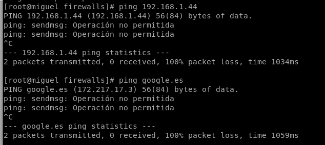

# <u>__PRÁCTICA 4 - FIREWALLS__</u>

## __IPs__
+ __IP host principal:__ 192.168.1.104  
+ __IP host 2:__ 192.168.1.44  
+ __IP dockers:__ 172.19.0.2  / 172.19.0.3 / 172.19.0.4  
`[isx46410800@miguel firewalls]$ docker run --rm --name net1 -h net1 --net mynet -d isx46410800/net19:nethost`  
`[isx46410800@miguel firewalls]$ docker run --rm --name net2 -h net2 --net mynet -d isx46410800/net19:nethost`  
`[isx46410800@miguel firewalls]$ docker run --rm --name net3 -h net3 --net mynet -d isx46410800/net19:nethost`  

## __Ejemplo Inicial: `ip-default.sh`__
En este ejemplo borramos todas las reglas actuales, establecemos una politica por defecto de todo abierto, permite todo el tráfico de entrada/salida en loopback y en nuestra IP host local. (Igualmente por defecto la politica por defecto ACCEPT ya lo hacía). También indicamos si el host hace de router, en este caso no.

[script ip-default.sh](practica4/ip-default.sh)  

+ En cada script ponemos la orden `iptables -L -t nat` para que al ejecutarlo, nos muestre las reglas generadas:  
```
[root@miguel firewalls]# ./ip-default.sh
Chain PREROUTING (policy ACCEPT)
target     prot opt source               destination         
Chain INPUT (policy ACCEPT)
target     prot opt source               destination         
Chain OUTPUT (policy ACCEPT)
target     prot opt source               destination         
Chain POSTROUTING (policy ACCEPT)
target     prot opt source               destination         
Chain DOCKER (0 references)
target     prot opt source               destination   
```

#### __COMPROBACIONES__  
+ Entre un host principal y otro ordenador(host 2) hacemos intercambio de pings, ssh, telnet de servicios echo, daytime... para comprobar que en efecto, sí se acepta todo tipo de conexiones de entrada y salida propias de la interficie y del loopback.


## __Ejemplo 01: `ip-01-input.sh`__  
En este ejemplo continuamos con la misma parte de antes pero ahora establecemos unas serie de reglas `INPUT` para el tráfico de entrada por nuestro puerto 80. Los diferentes puertos abiertos relacionados con el puerto 80 de httpd están configurados en `/etc/xinetd.d/`.  

En nuestro caso empleamos dos ordenadores, el principal y el host2. Hemos establecido reglas en que según que puerto indiquemos (2080,3080...) permitiremos que nuestro host2 pueda o no acceder o que otros hosts de la red puedan conectarnos por estos puertos.

#### __COMPROBACIONES__  
+ Seguimos viendo que para conectarnos al host2 no tenemos problemas ya que no hemos cambiado ninguna regla de `OUTPUT`  


+ Aquí sí podemos ver que ahora al conectarnos según que puerto nos permite o no el acceso desde host2: por ejemplo, por el puerto 2080 y 5080 no podrá acceder pero sí por el puerto 4080 y 7080.  


## __Ejemplo 02: `ip-02-ouput.sh__


#### __COMPROBACIONES__  

## __Ejemplo 03:__

#### __COMPROBACIONES__  

## __Ejemplo 04:`ip-04-icmp.sh`__
En este ejemplo utilizaremos unas reglas personalizadas para los pings que puede hacer o no nuestro ordenador principal respecto a diferentes casos configurados en iptables.  

[script ip-default.sh](practica4/ip-04-icmp.sh)  

#### __COMPROBACIONES__  
+ No permitir hacer pings al exterior:  
  `iptables -A OUTPUT -p icmp --icmp-type 8 -j DROP`

  

+ No podemos hacer pings al host2:  
  `iptables -A OUTPUT -p icmp --icmp-type 8 -d 192.168.1.44 -j DROP`

  

+ No permitimos responder a los pings que nos hagan:    
  `iptables -A OUTPUT -p icmp --icmp-type 0 -j DROP`

  

+ No aceptamos recibir respuestas de ping:  
  `iptables -A INPUT -p icmp --icmp-type 0 -j DROP`

  


## __Ejemplo 05:__

#### __COMPROBACIONES__  

## __Ejemplo 06:__

#### __COMPROBACIONES__  

## __Ejemplo 07:__

#### __COMPROBACIONES__  

## __Ejemplo 08:__

#### __COMPROBACIONES__  

## __Ejemplo 09:__

#### __COMPROBACIONES__  

## __Ejemplo 10:__

#### __COMPROBACIONES__  

## __Ejemplo 11:__

#### __COMPROBACIONES__  
